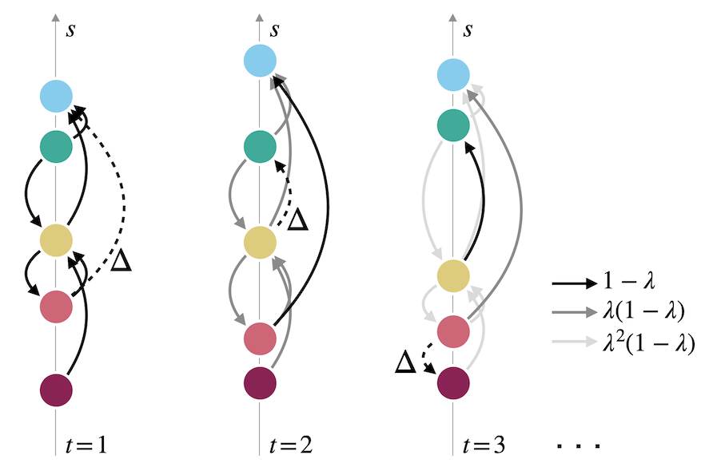

# Emergence of Hierarchy in Networked Endorsement Dynamics

This code repository, written primarily in Python, accompanies the paper "Emergence of Hierarchy in Networked Endorsement Dynamics" by [Mari Kawakatsu](https://scholar.princeton.edu/ctarnita/people/mari-kawakatsu), [Phil Chodrow](https://www.philchodrow.com/), [Nicole Eikmeier](https://eikmeier.sites.grinnell.edu/), and [Dan Larremore](https://larremorelab.github.io/). It includes core code code running simulations and inferring parameters, as well as helper code for reading data and performing miscellaneous computations. 

The primary use-cases for our model are simulating synthetic trajectories with known parameters and inferring parameters from known trajectories. The notebook `demo.ipynb` gives simple, annotated examples of both of these tasks. 

